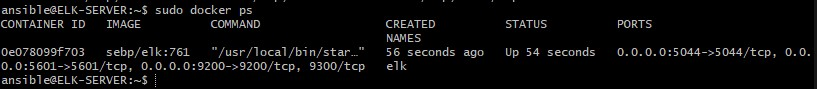

## Automated ELK Stack Deployment

The files in this repository were used to configure the network depicted below.

These files have been tested and used to generate a live ELK deployment on Azure. They can be used to either recreate the entire deployment pictured above. Alternatively, select portions of the playbook file may be used to install only certain pieces of it, such as Filebeat and Metricbeat.

  - [Install ELK](Ansible/install-elk.yml)
  - [Install DVWA](Ansible/dvwa_install.yml)  
  - [Filebeat Playbook](Ansible/filebeat-playbook.yml)
  - [Metricbeat Playbook](Ansible/metricbeat-playbook.yml)

This document contains the following details:
- Description of the Topology
- Access Policies
- ELK Configuration
  - Beats in Use
  - Machines Being Monitored
- How to Use the Ansible Build

### Description of the Topology

The main purpose of this network is to expose a load-balanced and monitored instance of DVWA, the D*mn Vulnerable Web Application.

Load balancing ensures that the application will be highly available, in addition to restricting access to the network.
- What aspect of security do load balancers protect? 
    -  Load Balancers protects from distributed denial-of-service (DDoS) attacks. Which is done by shifting attack from the corporate server to a public cloud                provider. Load Balancer uses hardware defense such as a perimeter firewall that can be very costly and requires signigicant maintenance over time.
    -  Reference: Load balancing 101 - learn all about load balancers. Avi Networks. (2022, August 19). Retrieved August 20, 2022, from
       https://avinetworks.com/what-is-load-balancing/ 
- What is the advantage of a jump box?_
    - Advantage of a jump box is to enable installationg of DVWA and ELK containers so an user can visualize the logs that are created on the server.
    - Jump Box is a network remote virtual machine that enables a user to remotely access other VMS via ssh.

Integrating an ELK server allows users to easily monitor the vulnerable VMs for changes to the log files and system resources.
- What does Filebeat watch for?
    -  Filebeat is a lightweight shipper for forwarding and centralizing log data. Filebeat monitors log files or locations where you specify, collect log events, and
       forwards them either to Elasticsearch or Logstash for indexing. When filebeat starts, it also starts a harvestor where each of harvestor reads a single log for
       new content and sends it to libbeat, which aggregates the events and sends the aggregated data to the output you have set for filebeat.
    -  Reference: Filebeat overviewedit. Elastic. (n.d.). Retrieved August 20, 2022, from 
       https://www.elastic.co/guide/en/beats/filebeat/current/filebeat-overview.html#:~:text=Filebeat%20overviewedit,Elasticsearch%20or%20Logstash%20for%20indexing. 
- What does Metricbeat record?
    - Metricbeat is a lightweight agent that can be installed on target servers to periodically collect metric data from your target servers, this could be operating
      system metrics such as CPU or memory or data related to services running on the server. It can also be used to monitor other beats and ELK stack itself. It is 
      built on top of libbeat — a GO framework. Metrics is the measurement of behaviour and usage of system resources that can be collected and monitored from the 
      system. 
    - Reference: Yadav, V. (2021, July 31). Getting started with Metricbeat. Medium. Retrieved August 20, 2022, from 
      https://medium.com/devops-dudes/getting-started-with-metricbeat-
      7c5718e6b3f4#:~:text=Metricbeat%20is%20a%20lightweight%20agent,beats%20and%20ELK%20stack%20itself. 

The configuration details of each machine may be found below.

| Name                 | Function       | IP Address    | Operating System |
|----------------------|----------------|---------------|------------------|
| Jump-Box-Provisioner | Gateway        | 20.9.8.71     | Linux            |
| Web-1                | DVWA Container | 20.9.54.192   |                  |
| Web-2                | DVWA Container | 20.9.54.192   |                  |
| Web-3                | DVWA Container | 20.9.54.192   |                  |
| ELK-SERVER           | ELK Container  | 20.127.31.165 |                  |
### Access Policies

The machines on the internal network are not exposed to the public Internet. 

Only the Jump-Box-Provisioner machine can accept connections from the Internet. Access to this machine is only allowed from the following IP addresses:
- This machine is accesssible by: 
  - My personal ip address:       73.101.106.120

Machines within the network can only be accessed by Jump-Box-Provisioner.
- Machine's public ip address:  20.9.8.71
- Machine's private ip address: 10.0.0.4
- Machines that can be accessed from this main VM are Web-1, Web-2, Web-3, and ELK-SERVER
- Which machine did you allow to access your ELK VM? What was its IP address?
  - VMs Web-1, Web-2, or Web-3 anyone machine that can be turned on can be used to access ELK-SERVER VM with following username and ip address:
    - username - elkserveradmin
    - ipaddress - 20.127.31.165
    - command - ssh elkserver@20.127.31.165 from any web vms.

A summary of the access policies in place can be found in the table below.

| Name                 | Publicly Accessible   | Allowed IP Addresses       |
|----------------------|-----------------------|----------------------------|
| Jump-Box-Provisioner | Yes                   | 73.101.106.120             |
| Web-1                | No                    | 10.0.0.4                   |
| Web-2                | No                    | 10.0.0.4                   |
| Web-3                | No                    | 10.0.0.4                   |
| ELK-SERVER           | No                    | 10.0.0.5,10.0.0.6,10.0.0.7 |
### Elk Configuration

Ansible was used to automate configuration of the ELK machine. No configuration was performed manually, which is advantageous because...
- It enables full control of a server and the configuration errors are reduced.

The playbook implements the following tasks:
- Install Docker - by running docker run -it cyberxsecurity:ansible /bin/bash a docker installs on the jump box vm
- Start and Attach Docker that was created by docker run it command
- ssh into that container and go to the hosts file located in /etc/ansible directory of docker.
- Update that file with these commands:
-   [Hosts](Ansible/hosts)

The following screenshot displays the result of running `docker ps` after successfully configuring the ELK instance.

### Target Machines & Beats
This ELK server is configured to monitor the following machines:
- Web-1 10.0.0.5
- Web-2 10.0.0.6
- Web-3 10.0.0.7

We have installed the following Beats on these machines:
- - [Install ELK](Ansible/install-elk.yml) - Installs ELK Container on 10.1.0.4/20.127.31.165 to enable the use of Kibana
  - [Install DVWA](Ansible/dvwa-install.yml) - Installs DVWA Container on 10.0.0.5, 10.0.0.6, 10.0.0.7 (All 3 Web VMs) to enable to the use of Damn Vulnerability Web 
    Access page on 20.9.54.192 website.
  - [Filebeat Playbook](Ansible/filebeat-playbook.yml) - Installed on ELK container to initialize the visualization and analyzation of log files.
  - [Metricbeat Playbook](Ansible/metricbeat-playbook.yml) - Installed on ELK container to initialize the visualization and analyzation of system metrics logs   
    generated by system CPU.

These Beats allow us to collect the following information from each machine:
- - [ELK](Ansible/install-elk.yml) - Enable the use of Kibana server on browser to view the logs generated by filebeat and metricbeat
  - [DVWA](Ansible/dvwa-install.yml) - Enables the use of Damn Vulnerability Web Access page on 20.9.54.192 website.
  - [Filebeat](Ansible/filebeat-playbook.yml) - Initializes the visualization and analyzation of log files.
  - [Metricbeat](Ansible/metricbeat-playbook.yml) - Initializes the visualization and analyzation of system metrics logs   
    generated by system CPU.

### Using the Playbook
In order to use the playbook, you will need to have an Ansible control node already configured. Assuming you have such a control node provisioned: 

SSH into the control node and follow the steps below:
- Copy the _____ file to _____.
- Update the _____ file to include...
- Run the playbook, and navigate to ____ to check that the installation worked as expected.
Answers:
_Answer the following questions to fill in the blanks:_
- _Which file is the playbook? Where do you copy it?_
-   [install-elk.yml](Ansible/install-elk.yml)
  - [dvwa-install.yml](Ansible/dvwa_install.yml)
  - [filebeat-playbook.yml](Ansible/filebeat-playbook.yml)
  - [metricbeat-playbook.yml](Ansible/metricbeat-playbook.yml)'
  - These all files are located in /etc/ansible/roles directory in the docker container remote vm.
  - These files are executed by putting ansible-playbook /etc/ansible/roles/filename.yml
- Which file do you update to make Ansible run the playbook on a specific machine? 
  - The Hosts File in /etc/ansible is updated to run the playbooks on a specific machine.
  - [Hosts](Ansible/hosts)
- How do I specify which machine to install the ELK server on versus which to install Filebeat and Metricbeat on?_
  - It is in [Hosts](Ansible/hosts) file, in which you have to add "10.1.0.4 ansible_python_interpreter=/usr/bin/python3" to it.
- Which URL do you navigate to in order to check that the ELK server is running?
  - The url to check that the ELK server is working is http://[your.VM.IP]:5601/app/kibana
  - In my Project this link will be changed to http://20.127.31.165:5601/app/kibana#/home
  - Image below: 
    -

_As a **Bonus**, provide the specific commands the user will need to run to download the playbook, update the files, etc._
